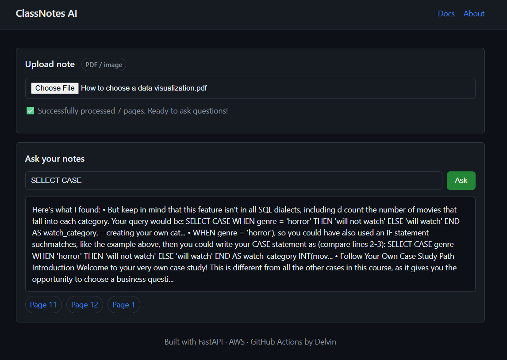

# StudyNotesAI
StudyNotesAI is a serverless web application that transforms handwritten or PDF class notes into a searchable knowledge base.
Upload your notes, run OCR with AWS Textract, and then query them through a simple Q&A interface powered by FastAPI

# Features
Upload & OCR: Upload PDFs or images of handwritten/typed notes → automatically stored in Amazon S3 and processed by AWS Textract.
Ask Your Notes: Query your notes in plain English; answers are linked back to the original note pages.
Scalable Backend: Deployed with AWS Lambda + API Gateway using SAM templates.
Frontend: Lightweight HTML/JS styled in GitHub’s dark theme for a professional UI.
Database: Amazon DynamoDB for storing indexed text and metadata.
CI/CD: Source code managed in GitHub, with GitHub Actions for testing and deployment automation.
Security & CORS: Configured API Gateway CORS and IAM-based policies for safe, cross-origin access.

Future: Working on Putting CHATGPT wrapper to give accurate responses and Also Fixation of more relevant answers instead of getting lost. 
Currently Works Best with 2-3 PDFs.

Made with AWS cloud using S3, DynamoDB, Lambda, Textract and also implemented Docker

